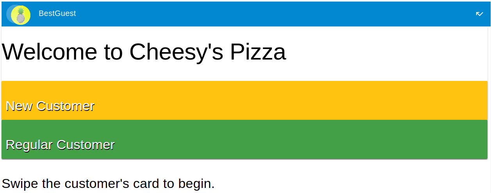
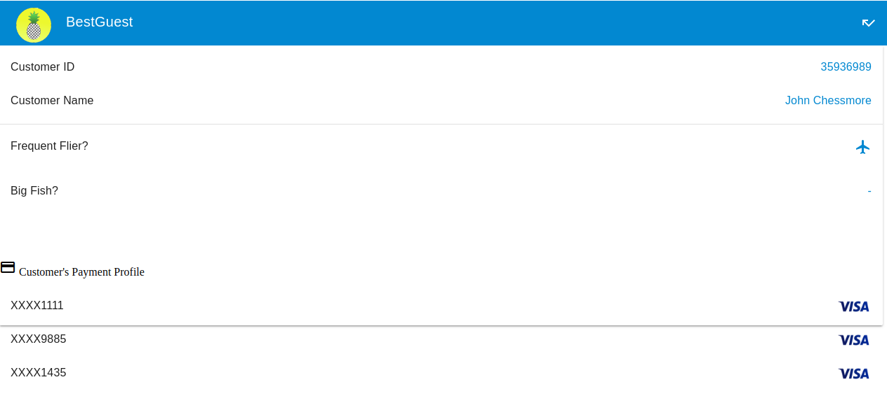
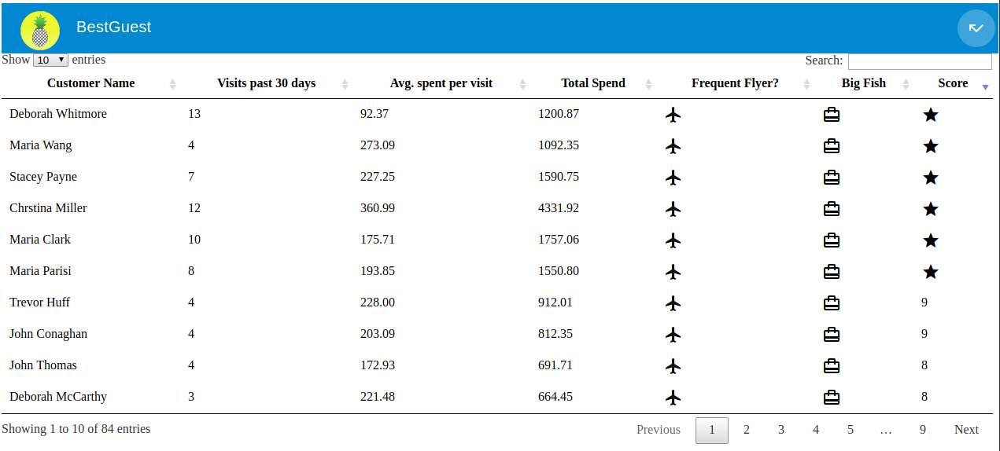

# BestGuest

An application which allows a business to collect and coorelate payment data to see their most valuable customers. Built for the Visa and Small Business Administration hackathon.

## Data Used:
- Authorize.net APIs (simulated responses)
- [Data.gov dataset](https://catalog.data.gov/dataset/purchase-card-pcard-fiscal-year-2014) (filtered)

## Screenshots

